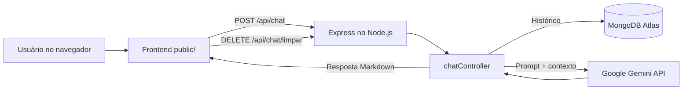

# Relatório de Release

## 1. Identificação

| Campo | Informação |
| --- | --- |
| Projeto Integrador | Campo Aberto |
| Disciplina | Serviços em Nuvem |
| Equipe | **Preencher nome da equipe** |
| Integrantes | **Preencher nomes e responsabilidades** |
| Data da sprint | 24/09/2026 |

## 2. Objetivo da Sprint

Evoluir o agente de IA para uma aplicação web com memória persistente e uma arquitetura de backend organizada. A solução passou a salvar as conversas no MongoDB Atlas, recuperar o contexto antes de cada resposta e renderizar Markdown no frontend.

Também foram adicionados o envio de mensagens com `Enter`, o botão de limpeza do histórico e respostas HTTP específicas para erros de quota ou indisponibilidade do Gemini.

Nesta evolução, o agente também ganhou Function Calling: ele pode consultar o clima atual de uma cidade por meio da OpenWeatherMap quando a intenção da pergunta exigir dados em tempo real.

Também foi adicionada autenticação JWT: cadastro, login, senha com bcrypt, middleware Bearer e memória isolada por usuário.

## 3. Arquitetura em Nuvem



### Serviços e tecnologias

- **Node.js + Express:** servidor HTTP e roteamento da API.
- **MongoDB Atlas + Mongoose:** banco de dados em nuvem e modelagem das mensagens.
- **Google Gemini API:** geração das respostas com personalidade de narrador esportivo.
- **Marked.js:** conversão de Markdown para HTML no frontend.
- **DOMPurify:** sanitização do HTML gerado antes da exibição.
- **OpenWeatherMap:** dados atuais de temperatura e condições climáticas acionados pelo agente.
- **CORS e variáveis de ambiente:** integração entre clientes e proteção de credenciais.
- **bcryptjs + JWT:** hash de senhas e autenticação stateless das rotas privadas.

### Organização do código

- `server.js`: inicialização do Express, conexão com o banco e arquivos estáticos.
- `models/Mensagem.js`: schema e model Mongoose.
- `controllers/chatController.js`: memória, prompt, chamada Gemini e tratamento de erros.
- `routes/chatRoutes.js`: endpoints de conversa.
- `public/`: interface web e comportamento do chat.

## 4. Trecho de Código-Chave

O histórico é convertido para o formato aceito pelo Gemini, removendo IDs internos do MongoDB. Em seguida, o chat usa esse contexto antes de enviar a nova pergunta:

```js
const historicoSalvo = await Mensagem.find()
    .select('role parts -_id')
    .sort({ dataHora: -1 })
    .limit(20)
    .lean();

const historico = historicoSalvo.reverse().map((mensagem) => ({
    role: mensagem.role,
    parts: mensagem.parts.map((parte) => ({ text: parte.text }))
}));

const chat = model.startChat({ history: historico });
const resultado = await chat.sendMessage(prompt);
```

Após a resposta, a pergunta e a resposta são gravadas como duas mensagens relacionadas, permitindo que uma nova requisição recupere o contexto anterior.

## 5. Desafios e Soluções

### Saturação e quota do Gemini

O modelo retornou `503` por alta demanda e depois `429` por limite do plano gratuito. A aplicação passou a tentar modelos alternativos e a devolver respostas HTTP específicas, evitando apresentar todos os casos como erro interno.

### IDs do Mongoose no histórico

Os subdocumentos de `parts` recebiam `_id` automaticamente. O Gemini rejeitava esse campo com erro de payload. A solução foi mapear explicitamente o histórico para enviar somente `role` e `text`.

### Segurança das credenciais

As chaves ficam em `.env`, protegido pelo `.gitignore`. O arquivo `.env.example` documenta as variáveis necessárias sem conter valores reais.

### Markdown e segurança no frontend

As respostas passam por `marked.parse()` para exibir títulos, listas e blocos de código. Antes de inserir o resultado na página, o HTML é sanitizado com DOMPurify.

## 6. Testes Realizados

- Conexão real com o MongoDB Atlas confirmada.
- `GET /api/status` retornando HTTP 200.
- `POST /api/chat` sem pergunta retornando HTTP 400.
- Frontend carregando em `http://localhost:3000`.
- Bibliotecas `marked.js` e DOMPurify carregadas no navegador.
- Envio de mensagem com `Enter` confirmado.
- `.env` e `node_modules` mantidos fora do Git.

## 7. Link de Produção

- Repositório GitHub: **Preencher link do repositório oficial da equipe**.
- Deploy Render/Vercel: **Preencher URL de produção após o deploy**.

## 8. Próximos Passos

1. Publicar o repositório oficial da equipe no GitHub.
2. Configurar `GEMINI_API_KEY`, `MONGO_URI` e `PORT` nas variáveis de ambiente do Render.
3. Atualizar os links desta seção com as URLs de produção.
4. Adicionar prints do frontend e do MongoDB Atlas à entrega final.